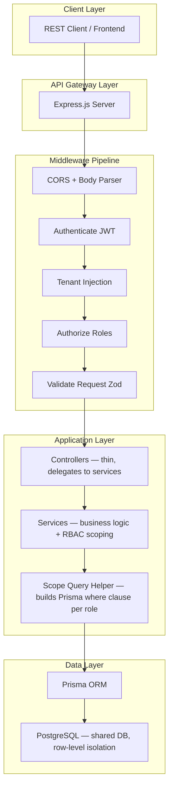

# Finance Intelligence Dashboard — System Design (Step 1)

## Overview

A multi-tenant, role-based financial tracking and analytics backend. Multiple companies coexist in a single PostgreSQL deployment. Each company has users, teams, projects, budgets, and financial records. The system provides 5 analytics APIs beyond standard CRUD, all scoped by tenant and role.

---

## 1. High-Level Architecture



### Component Responsibilities

| Layer | Component | Responsibility |
|---|---|---|
| **Middleware** | `authenticate` | Verify JWT, decode payload, attach `req.user` with `userId`, `companyId`, `role`, `teamId` |
| **Middleware** | `authorize(roles[])` | Factory function; rejects if `req.user.role` not in allowed list |
| **Middleware** | `validateRequest(schema)` | Validate `body`, `params`, `query` against Zod schema; reject with 400 on failure |
| **Controller** | `*Controller` | Parse validated input, call service, format response via `ApiResponse` utility |
| **Service** | `*Service` | All business logic lives here. Every query passes through `scopeQuery(user)` to enforce tenant + role isolation |
| **Utility** | `scopeQuery(user)` | Returns a Prisma `where` clause based on user role: EMPLOYEE → `userId`, MANAGER → `teamIds[]`, ADMIN → `companyId` only |
| **Utility** | `ApiResponse` | Standard envelope: `{ success, data, error, meta }` |
| **Utility** | `AppError` | Custom error class with `statusCode`, `isOperational` flag |

---

## 2. Request Lifecycle

Every request follows this exact sequence:

```
HTTP Request
  │
  ├─ 1. CORS + express.json()
  │     Parse body, allow cross-origin
  │
  ├─ 2. authenticate(req, res, next)
  │     • Extract Bearer token from Authorization header
  │     • Verify JWT signature + expiry
  │     • Decode payload → { userId, companyId, role, teamId }
  │     • Attach as req.user
  │     • If invalid → 401 Unauthorized
  │
  ├─ 3. authorize(...roles)(req, res, next)
  │     • Check req.user.role ∈ allowedRoles
  │     • If not → 403 Forbidden
  │
  ├─ 4. validateRequest(zodSchema)(req, res, next)
  │     • Validate req.body / req.params / req.query against schema
  │     • If fails → 400 Bad Request with Zod error details
  │
  ├─ 5. Controller
  │     • Extract validated data
  │     • Call service method with user context
  │     • Return ApiResponse.success(data) or ApiResponse.error(err)
  │
  ├─ 6. Service Layer
  │     • Build scoped query via scopeQuery(req.user)
  │     • Execute business logic
  │     • Prisma queries — ALWAYS include companyId in where clause
  │     • Return data or throw AppError
  │
  └─ 7. Global Error Handler (catch-all)
        • AppError (operational) → return status + message
        • Unknown error → 500 Internal Server Error, log stack
```

> [!IMPORTANT]
> **companyId is NEVER derived from user input.** It is always extracted from the JWT payload, which was set at login time from the database. This prevents tenant spoofing.

---

## 3. Multi-Tenancy Strategy

### Approach: Shared Database, Row-Level Isolation

| Aspect | Decision | Rationale |
|---|---|---|
| **Database** | Single PostgreSQL instance | Simplest to operate; sufficient for 100s of tenants |
| **Schema** | Single shared schema | No schema-per-tenant overhead; Prisma doesn't natively support dynamic schemas |
| **Isolation** | `companyId` column on every tenant-scoped table | Row-level filtering via application code |
| **Enforcement** | Service layer + `scopeQuery()` | Every Prisma query includes `companyId` from JWT — never from request body/params |

### Tables and Tenant Scoping

| Table | Scoped by `companyId`? | Notes |
|---|---|---|
| `Company` | N/A (is the tenant) | Root entity |
| `User` | ✅ FK → Company | Users belong to exactly one company |
| `Team` | ✅ FK → Company | Teams belong to exactly one company |
| `Project` | ✅ FK → Company | Projects belong to exactly one company |
| `FinancialRecord` | ✅ FK → Company | Denormalized `companyId` for fast filtering (avoids JOIN through user/team) |
| `Budget` | ✅ via Team → Company | Budget is 1:1 with Team; inherits tenant scope through team |

> [!WARNING]
> The current `Budget` model lacks a `companyId` column and lacks period scoping. This will be fixed in Step 2 (Database Design). Budget must have its own `companyId` for direct filtering and a `period` field for monthly budget tracking.

### Why Denormalize `companyId` on FinancialRecord?

Without denormalization, querying "all expenses for company X" requires a JOIN through `User` or `Team` to reach `companyId`. For analytics queries that aggregate across thousands of records, this is a significant performance hit. By storing `companyId` directly on `FinancialRecord`, we enable:

- Single-table index scans for analytics (`WHERE companyId = ? AND date BETWEEN ? AND ?`)
- Simpler `scopeQuery()` logic — no JOINs needed
- Composite indexes: `(companyId, date)`, `(companyId, teamId)`, `(companyId, category)`

---

## 4. RBAC Enforcement Model

### Role Hierarchy

```
ADMIN  ──── Full access within their company
  │
MANAGER ─── Access within their managed team(s)
  │
EMPLOYEE ── Access to own records only
```

### Enforcement Layers (Defense in Depth)

**Layer 1 — Route-Level** (middleware):
```
authorize('ADMIN')           → Only admins can hit this route
authorize('MANAGER', 'ADMIN') → Managers and admins
authorize('EMPLOYEE', 'MANAGER', 'ADMIN') → All authenticated users
```

**Layer 2 — Service-Level** (scopeQuery):

This is the **critical** layer. Even if a route allows all roles, the data returned is filtered:

```typescript
// Conceptual implementation
function scopeQuery(user: AuthUser) {
  const base = { companyId: user.companyId };
  
  switch (user.role) {
    case 'ADMIN':
      return base;  // All company data
    case 'MANAGER':
      return { ...base, teamId: user.teamId };  // Team data only
    case 'EMPLOYEE':
      return { ...base, userId: user.userId };   // Own data only
  }
}
```

**Layer 3 — Prisma-Level** (indexes):
Composite indexes ensure that scoped queries are efficient, not just correct.

### RBAC Matrix

| Endpoint | EMPLOYEE | MANAGER | ADMIN |
|---|---|---|---|
| `POST /records` | Create own | Create for team | Create for company |
| `GET /records` | View own | View team's | View all in company |
| `PUT /records/:id` | Edit own | Edit team's | Edit any in company |
| `DELETE /records/:id` | Delete own | Delete team's | Delete any in company |
| `GET /analytics/*` | Own data only | Team data only | Company-wide |
| `POST /teams` | ❌ | ❌ | ✅ |
| `POST /budgets` | ❌ | Own team | ✅ |
| `GET /users` | ❌ | Team members | All company users |

### Manager Multi-Team Support

> [!NOTE]
> The current schema has a single `teamId` on `User`, meaning a user belongs to one team. For MANAGER role, this means they manage the team they belong to. If multi-team management is needed in the future, a `TeamMember` join table would replace the direct FK. For now, single-team is sufficient and simpler.

---

## 5. Scaling Considerations

### 5.1 Connection Pooling

```
                    ┌─────────────────┐
  Express Workers ──│  Prisma Client   │── Connection Pool ── PostgreSQL
  (single process) │  (singleton)     │   (default: 5-10)
                    └─────────────────┘
```

- **Prisma Client**: Instantiate once (singleton pattern), exported from `src/config/prisma.ts`
- **Pool Size**: Neon (serverless PG) already manages pooling via their pooler endpoint (`-pooler` in the connection URL)
- **Configuration**: `connection_limit` in the DATABASE_URL query string, typically `?connection_limit=10`

### 5.2 Caching Strategy (Redis — Future)

| Cache Target | TTL | Invalidation |
|---|---|---|
| `GET /analytics/summary` | 5 min | On new FinancialRecord create/delete |
| `GET /analytics/by-team` | 5 min | On new FinancialRecord create/delete |
| `GET /analytics/by-category` | 5 min | On new FinancialRecord create/delete |
| `GET /analytics/budget-vs-actual` | 5 min | On budget or record change |
| `GET /analytics/trends` | 15 min | Low-frequency, higher TTL |

Cache key pattern: `analytics:{companyId}:{endpoint}:{hash(queryParams)}`

> [!NOTE]
> Redis is documented as a future optimization. The initial implementation will not include Redis to keep the deployment simple. The service layer will be structured so caching can be added as a decorator/wrapper without modifying core logic.

### 5.3 Indexing Strategy

| Table | Index | Query Pattern |
|---|---|---|
| `User` | `(companyId)` | List users by company |
| `User` | `(email)` UNIQUE | Login lookup |
| `Team` | `(companyId)` | List teams by company |
| `Project` | `(companyId)` | List projects by company |
| `FinancialRecord` | `(companyId, date)` | Analytics: filter by company + date range |
| `FinancialRecord` | `(companyId, teamId)` | Analytics: by-team breakdown |
| `FinancialRecord` | `(companyId, category)` | Analytics: by-category breakdown |
| `FinancialRecord` | `(companyId, userId)` | EMPLOYEE scoped queries |
| `FinancialRecord` | `(teamId)` | MANAGER scoped queries |
| `Budget` | `(companyId)` | List budgets by company |
| `Budget` | `(teamId, period)` UNIQUE | One budget per team per period |

### 5.4 Pagination

Two strategies, offered simultaneously:

1. **Offset-based** (`?page=1&limit=20`): Simple, good for UI with page numbers. Default for all list endpoints.
2. **Cursor-based** (`?cursor=<lastId>&limit=20`): Better for large datasets, no page-skip performance degradation. Optional, via `?cursor=` query param.

---

## 6. Folder Structure (Final)

```
src/
├── config/
│   ├── env.ts              # Zod-validated environment variables
│   └── prisma.ts           # Prisma client singleton
│
├── controllers/
│   ├── auth.controller.ts
│   ├── company.controller.ts
│   ├── user.controller.ts
│   ├── team.controller.ts
│   ├── project.controller.ts
│   ├── financial-record.controller.ts
│   ├── budget.controller.ts
│   └── analytics.controller.ts
│
├── services/
│   ├── auth.service.ts
│   ├── company.service.ts
│   ├── user.service.ts
│   ├── team.service.ts
│   ├── project.service.ts
│   ├── financial-record.service.ts
│   ├── budget.service.ts
│   └── analytics.service.ts
│
├── routes/
│   ├── auth.routes.ts
│   ├── company.routes.ts
│   ├── user.routes.ts
│   ├── team.routes.ts
│   ├── project.routes.ts
│   ├── financial-record.routes.ts
│   ├── budget.routes.ts
│   ├── analytics.routes.ts
│   └── index.ts            # Route aggregator
│
├── middleware/
│   ├── authenticate.ts
│   ├── authorize.ts
│   ├── validate-request.ts
│   └── error-handler.ts
│
├── validations/
│   ├── auth.validation.ts
│   ├── company.validation.ts
│   ├── user.validation.ts
│   ├── team.validation.ts
│   ├── project.validation.ts
│   ├── financial-record.validation.ts
│   ├── budget.validation.ts
│   └── analytics.validation.ts
│
├── utils/
│   ├── api-response.ts     # Standard response envelope
│   ├── app-error.ts        # Custom error class
│   ├── scope-query.ts      # RBAC query builder
│   └── pagination.ts       # Offset + cursor pagination helpers
│
├── types/
│   └── express.d.ts        # Extend Express Request with user property
│
└── app.ts                  # Express app setup + server start
```

---

## 7. API Route Map (Preview)

| Method | Route | Auth | Roles | Description |
|---|---|---|---|---|
| `POST` | `/auth/register` | ❌ | — | Register company + first admin user |
| `POST` | `/auth/login` | ❌ | — | Login, returns access + refresh tokens |
| `POST` | `/auth/refresh` | ❌ | — | Refresh access token |
| — | — | — | — | — |
| `GET` | `/companies/me` | ✅ | ALL | Get own company details |
| `PUT` | `/companies/me` | ✅ | ADMIN | Update company details |
| — | — | — | — | — |
| `GET` | `/users` | ✅ | MANAGER, ADMIN | List users (scoped) |
| `GET` | `/users/:id` | ✅ | ALL | Get user (scoped) |
| `POST` | `/users` | ✅ | ADMIN | Create user in company |
| `PUT` | `/users/:id` | ✅ | ADMIN | Update user |
| `DELETE` | `/users/:id` | ✅ | ADMIN | Soft-delete user |
| — | — | — | — | — |
| `GET` | `/teams` | ✅ | ALL | List teams (scoped) |
| `POST` | `/teams` | ✅ | ADMIN | Create team |
| `PUT` | `/teams/:id` | ✅ | ADMIN | Update team |
| `DELETE` | `/teams/:id` | ✅ | ADMIN | Delete team |
| — | — | — | — | — |
| `GET` | `/projects` | ✅ | ALL | List projects (scoped) |
| `POST` | `/projects` | ✅ | MANAGER, ADMIN | Create project |
| `PUT` | `/projects/:id` | ✅ | MANAGER, ADMIN | Update project |
| `DELETE` | `/projects/:id` | ✅ | ADMIN | Delete project |
| — | — | — | — | — |
| `GET` | `/records` | ✅ | ALL | List financial records (scoped) |
| `POST` | `/records` | ✅ | ALL | Create financial record |
| `PUT` | `/records/:id` | ✅ | ALL | Update record (scoped) |
| `DELETE` | `/records/:id` | ✅ | ALL | Delete record (scoped) |
| — | — | — | — | — |
| `GET` | `/budgets` | ✅ | MANAGER, ADMIN | List budgets (scoped) |
| `POST` | `/budgets` | ✅ | MANAGER, ADMIN | Create/update budget |
| `PUT` | `/budgets/:id` | ✅ | MANAGER, ADMIN | Update budget |
| — | — | — | — | — |
| `GET` | `/analytics/summary` | ✅ | ALL | Income/expense/net for period |
| `GET` | `/analytics/by-team` | ✅ | MANAGER, ADMIN | Spending per team |
| `GET` | `/analytics/by-category` | ✅ | ALL | Spending per category |
| `GET` | `/analytics/budget-vs-actual` | ✅ | MANAGER, ADMIN | Budget vs actual per team |
| `GET` | `/analytics/trends` | ✅ | ALL | Month-over-month trends |

---

## 8. Execution Plan — Proposed Changes Per Step

### Step 2 — Database Design
- Redesign `prisma/schema.prisma` with:
  - `Budget` model: add `companyId`, `period` (string like "2026-04"), `totalBudget`, `usedAmount`
  - Add composite indexes for all multi-tenant query patterns
  - Add `@@unique([teamId, period])` on Budget
  - Add `refreshToken` field on `User` (or separate `RefreshToken` model)
  - Add `updatedAt` fields across all models

### Step 3 — Project Setup
- `src/config/env.ts` — Zod-validated env
- `src/config/prisma.ts` — Prisma singleton
- `src/utils/api-response.ts` — Response envelope
- `src/utils/app-error.ts` — Custom error class
- `src/middleware/error-handler.ts` — Global error handler
- Update `app.ts` — proper setup
- Update `package.json` — add dev/build scripts

### Step 4 — Auth System
- `src/services/auth.service.ts`
- `src/controllers/auth.controller.ts`
- `src/routes/auth.routes.ts`
- `src/validations/auth.validation.ts`
- `src/middleware/authenticate.ts`
- `src/middleware/authorize.ts`
- `src/types/express.d.ts`

### Step 5 — Core CRUD Modules
- Full controller + service + route + validation for: Company, User, Team, Project, FinancialRecord, Budget

### Step 6 — RBAC Enforcement
- `src/utils/scope-query.ts`
- Integrate into all services

### Step 7 — Analytics Engine
- `src/services/analytics.service.ts`
- `src/controllers/analytics.controller.ts`
- `src/routes/analytics.routes.ts`
- `src/validations/analytics.validation.ts`

### Step 8 — Validation & Error Handling
- Audit + harden all Zod schemas
- Centralized error normalization

### Step 9 — Performance & Scaling
- Add cursor-based pagination
- Document Redis strategy
- Verify all indexes

### Step 10 — Final Review
- Full audit, env docs, API reference

---

## Open Questions

> [!IMPORTANT]
> **1. Manager Multi-Team:** Should a manager be able to manage multiple teams? Currently the schema has a single `teamId` per user. If multi-team is needed, we need a `TeamMember` join table instead.

> [!IMPORTANT]
> **2. Budget Period Granularity:** The requirement says "per team per period (e.g. monthly)." Should we support only monthly, or also quarterly/yearly? I'll default to monthly with a `period` string like `"2026-04"`.

> [!IMPORTANT]
> **3. Registration Flow:** Should `/auth/register` create a new Company + the first Admin user in one step? Or should companies be pre-created and users register into existing companies?

> [!IMPORTANT]
> **4. Soft Delete vs Hard Delete:** Should user/record deletion be soft (set `isActive = false`) or hard (permanent)? The current `User` model has `isActive` suggesting soft delete. Should we apply the same pattern to financial records?

> [!IMPORTANT]
> **5. Refresh Token Storage:** Store refresh tokens in the database (a `RefreshToken` model) or as a field on `User`? A separate model supports multiple devices.

---

## Verification Plan

### Automated Tests
- After each step, compile with `npx tsc --noEmit` to verify type safety
- Test each API endpoint with curl/Postman after implementation
- Verify multi-tenancy isolation by creating 2 companies and confirming no data leaks

### Manual Verification
- Run full database migration after schema changes
- Test RBAC by logging in as each role and verifying access boundaries
- Test analytics endpoints with seed data across multiple teams/categories
